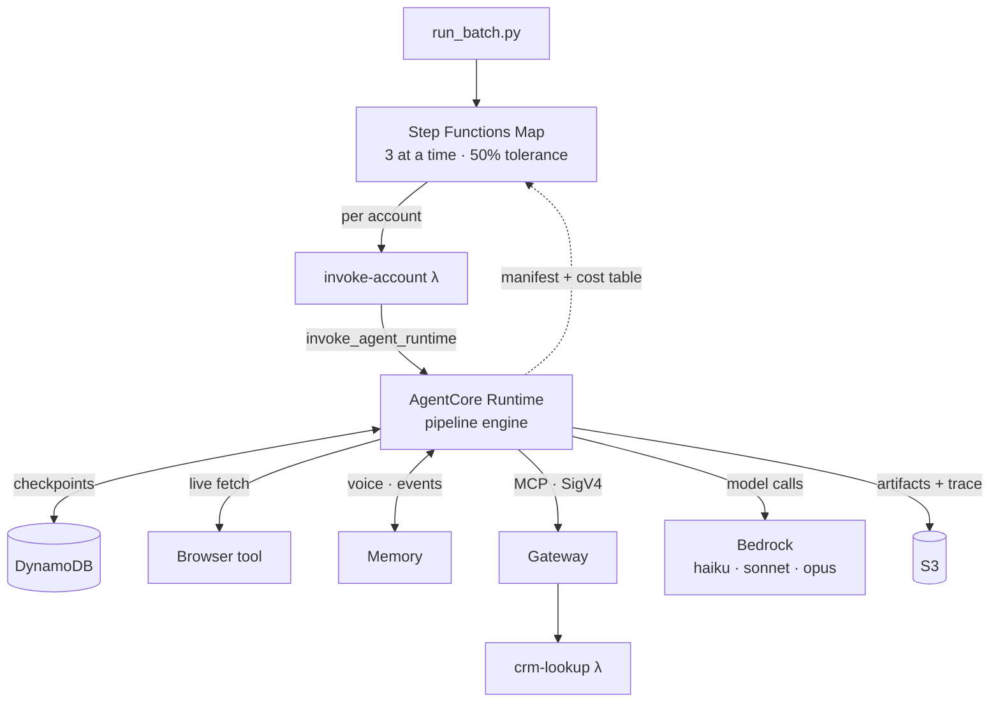
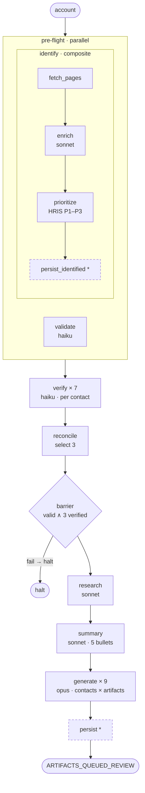
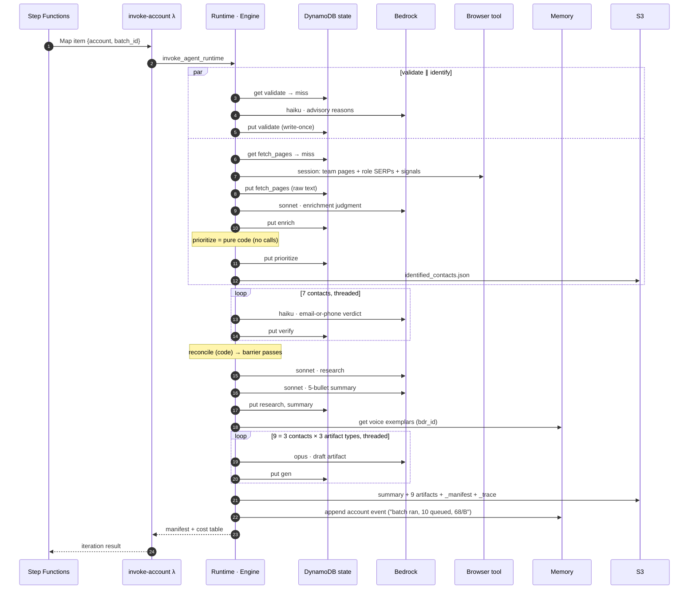
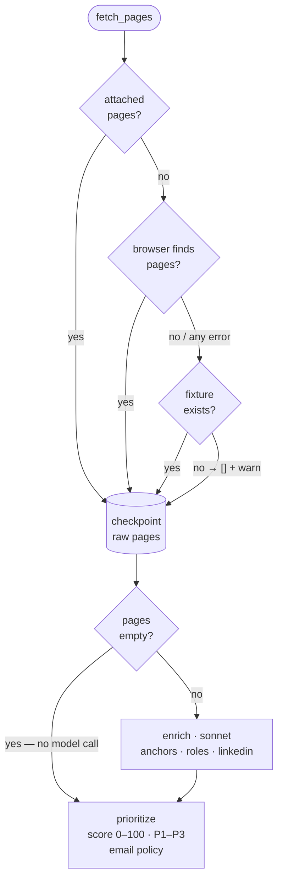
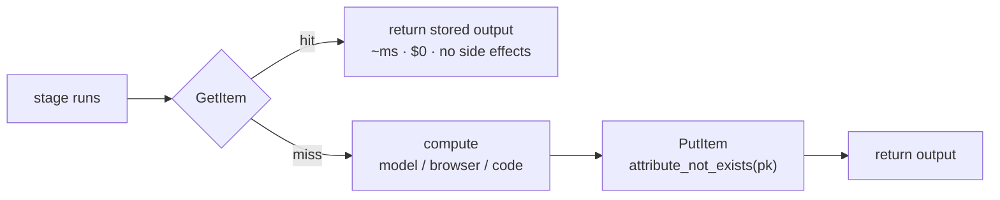
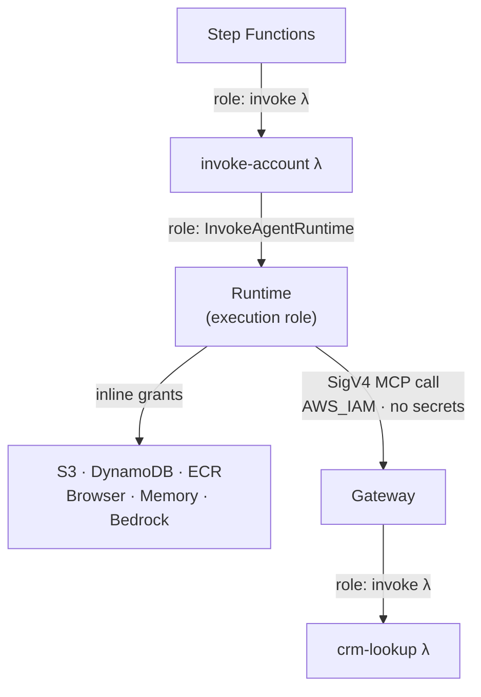
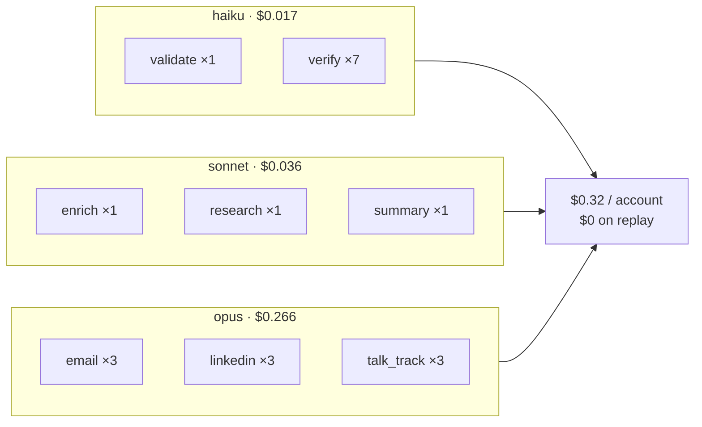

# Diagrams — components, flows, and agent invocations

All diagrams are Mermaid (GitHub renders them inline). SVG renders of the
same diagrams are embedded in `docs/overview.html` via
`scripts/render_diagrams.py`. Node labels stay terse on purpose — the detail
lives in the prose around each diagram and in `ARCHITECTURE.md` /
`ACCOUNT-LIFECYCLE.md`.

## 1 · End-to-end system flow

Batch in, artifacts out. The Lambda exists because Step Functions has no
native AgentCore integration; it threads `batch_id` and `param_overrides`
through to the runtime.

## 2 · The pipeline as executed (`bdr_outreach.yaml`)

The flow the engine walks per account. Every solid stage checkpoints
write-once; stages marked `*` are `checkpoint: false` — idempotent persists
that re-run on every replay. Validate runs in parallel with the whole
identify composite; verify fans over CRM + identified contacts (7 for the
Meridian mock); generate fans 3 selected contacts × 3 artifact types.

## 3 · One account, cold — who calls whom (sequence)

Every agent/service invocation in order, with the checkpoint reads/writes.

## 4 · Identify lane — fetch fallback + enrichment contract

The browser pass runs the full recipe (team paths + DuckDuckGo discovery,
role-targeted `"<company> <role>" LinkedIn` searches, a signals query) and is
best-effort: any failure falls through the chain. Empty pages skip the model
call entirely — nothing to judge means nothing invented. The prioritizer's
email policy: direct addresses always attach; pattern guesses only at HIGH
confidence.

## 5 · The checkpoint mechanic — why replay is free

Write-once at `(batch_id, account_id, stage_key)`: the conditional put means
the first writer wins; a whole-account replay is 0.8s vs ~36–50s cold.

## 6 · Auth & IAM — who signs what

Every hop is an IAM role or a SigV4 signature; the system stores zero
secrets. The runtime's execution role is toolkit-minted and discovered
post-deploy; the installer attaches six inline policies to it.

## 7 · Model roster — every agent call in one cold account

20 model calls, ~24k in / ~4.4k out tokens, ≈$0.32 cold and $0 on replay.
The tier lint keeps Opus inside generation-flagged stages only.

