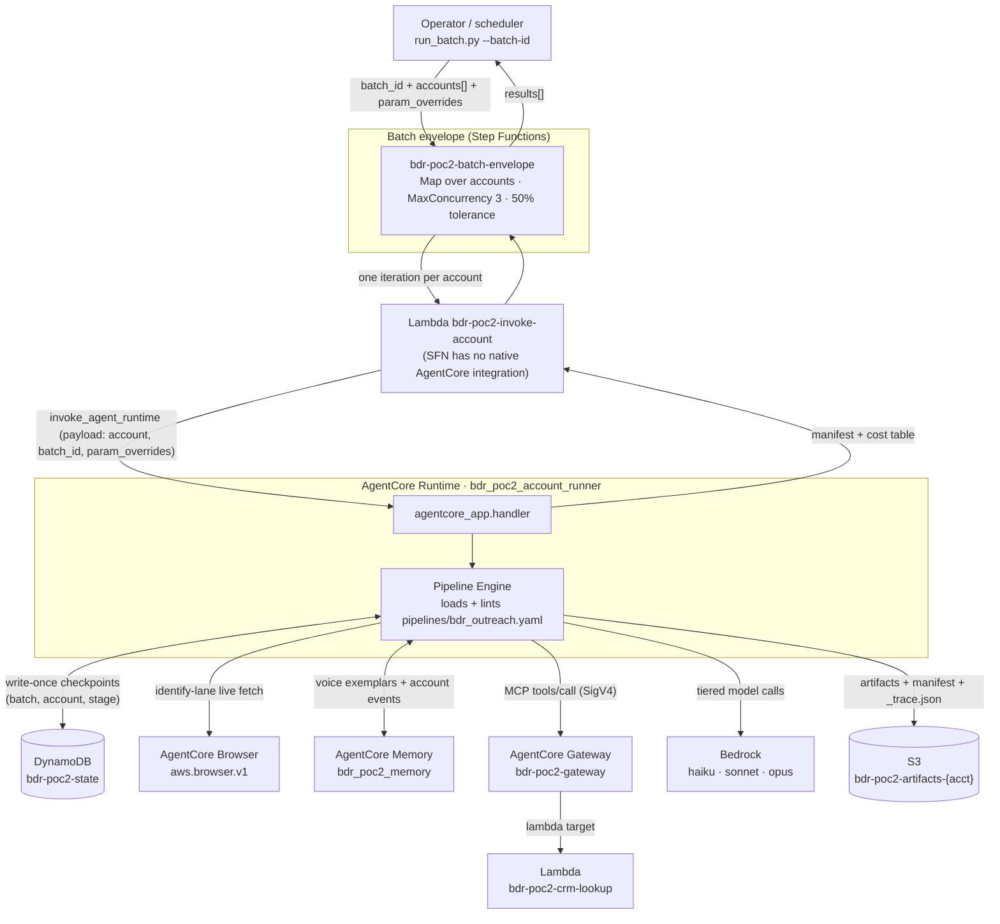
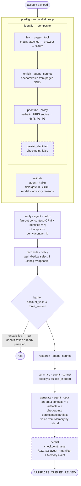
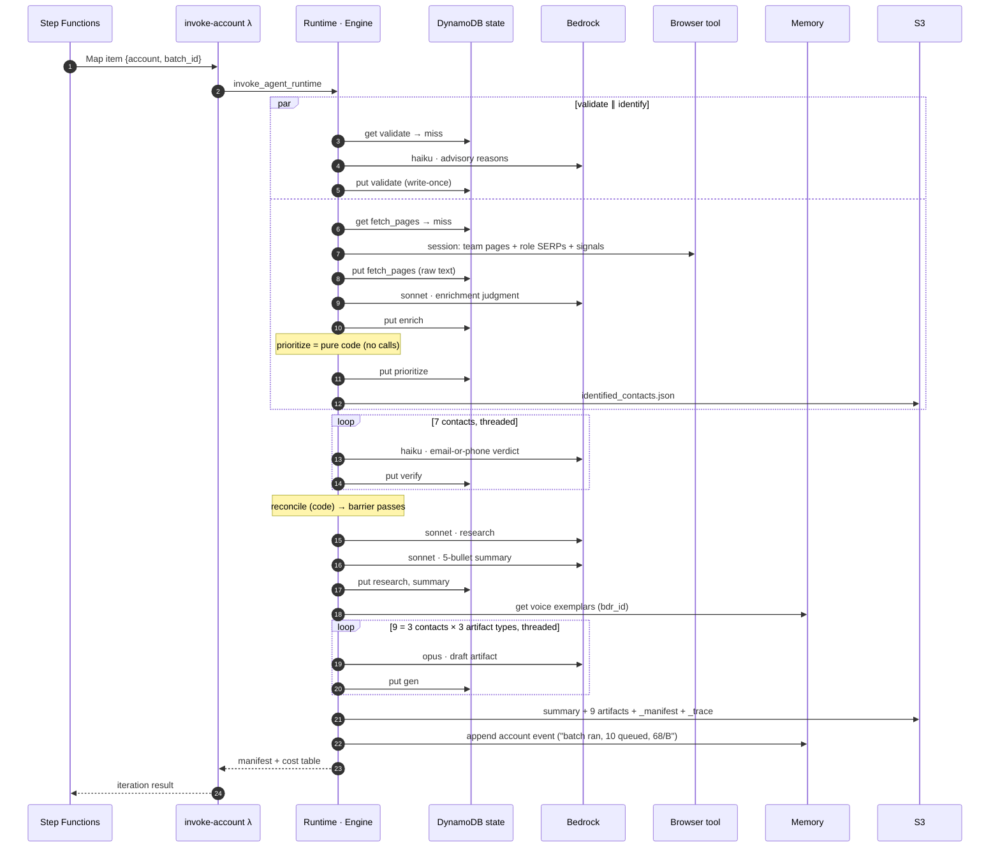
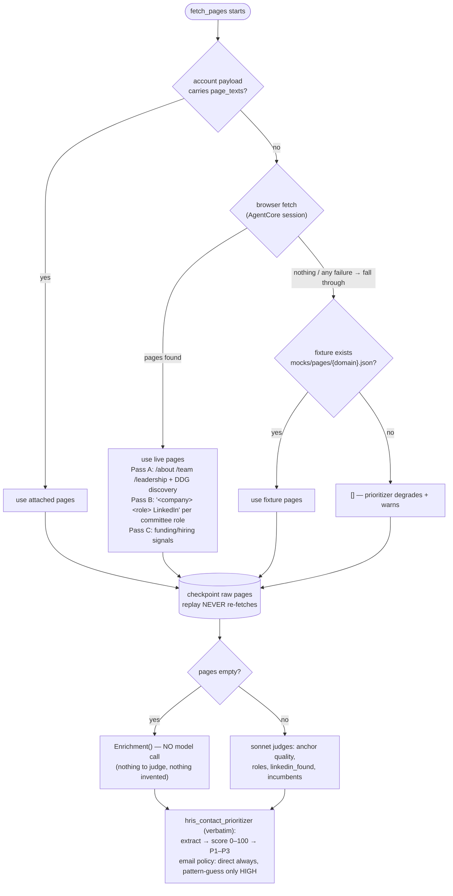
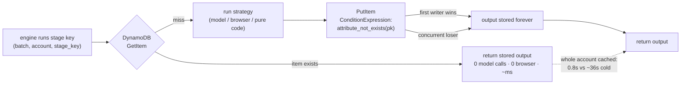
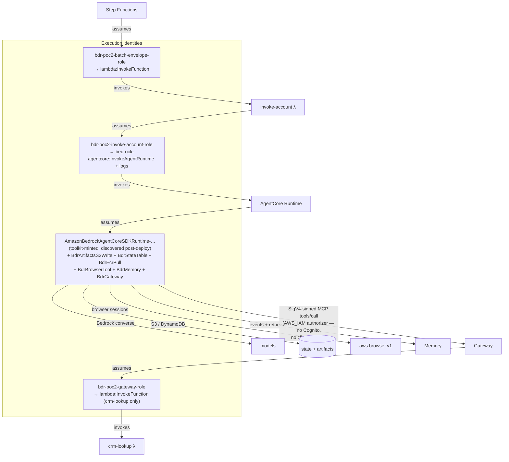
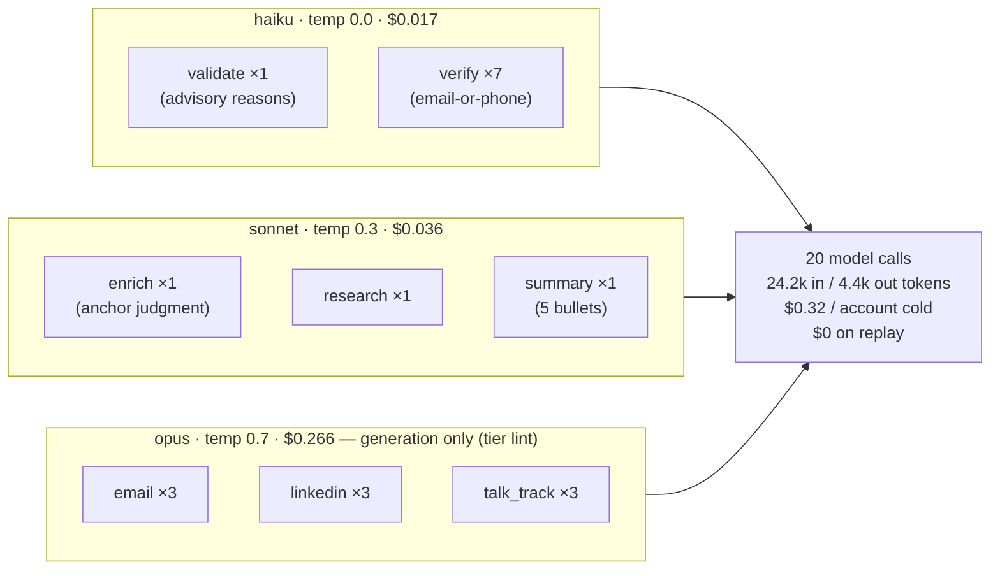

# Diagrams — components, flows, and agent invocations

All diagrams are Mermaid (GitHub renders them inline). SVG renders of the
same diagrams are embedded in `docs/overview.html`. Companions:
`ARCHITECTURE.md` (prose), `ACCOUNT-LIFECYCLE.md` (numbers).

## 1 · End-to-end system flow

Batch in, artifacts out — every component in the deployed path.

## 2 · The pipeline as executed (`bdr_outreach.yaml`)

The flow the engine walks per account. Solid nodes checkpoint write-once;
dashed nodes are idempotent persists that re-run on replay.

## 3 · One account, cold — who calls whom (sequence)

Every agent/service invocation in order, with the checkpoint reads/writes.

## 4 · Identify lane — fetch fallback + enrichment contract

## 5 · The checkpoint mechanic — why replay is free

## 6 · Auth & IAM — who signs what

No secrets anywhere: every arrow is an IAM role or SigV4 signature.

## 7 · Model roster — every agent call in one cold account

